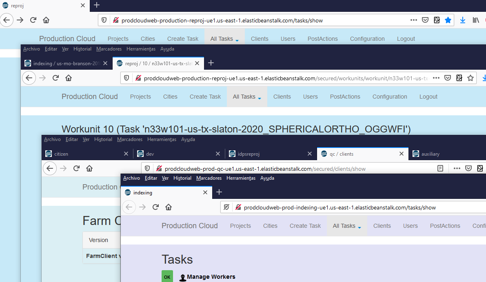

## TamperMonkey

[TamperMonkey](https://www.tampermonkey.net/) is a browser complement which
allows you running JS code associated to web pages and modify their content on
the fly.

You can use many user written scripts, avaliable on public repositories, but
you can also write your own, maybe simpler, but useful nonetheless.

### Our scripts

#### `DifferentiateFarms.tm`
This gets some data from the farms' URL and then
* sets a different background color for each of the farms
* puts in the title (browser tab) the farm name, task and workunit

This is nice just to know which tab you want to open, or to go back and forth
in your history.

